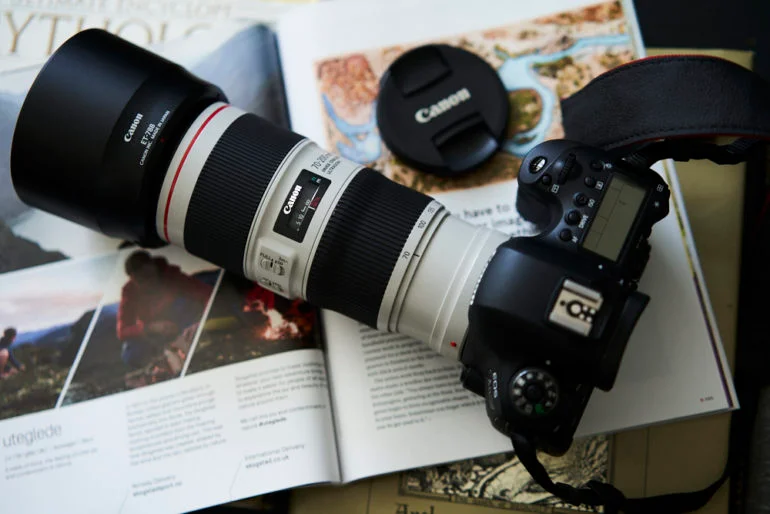
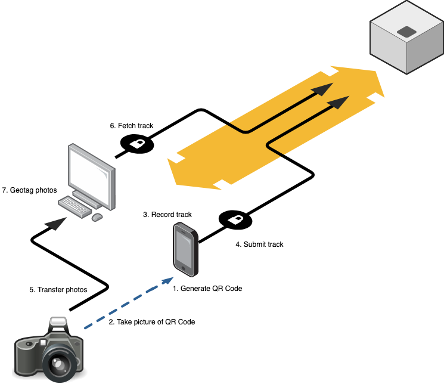
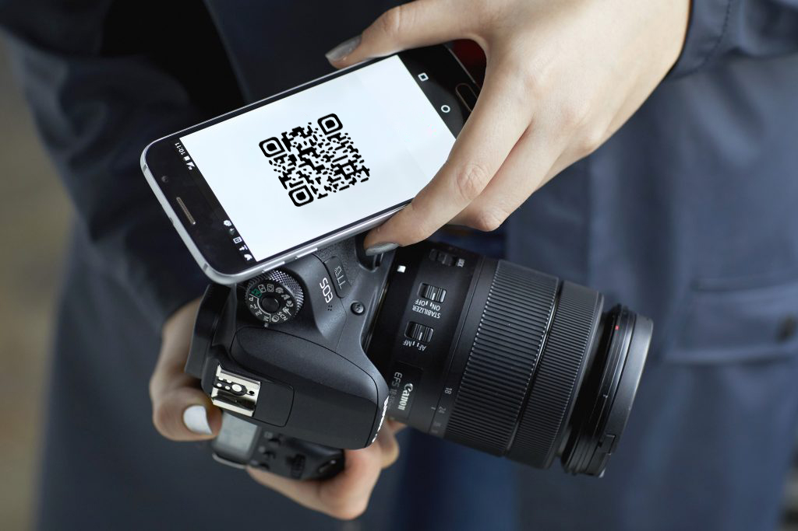
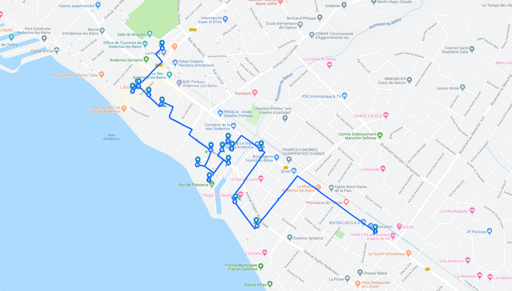
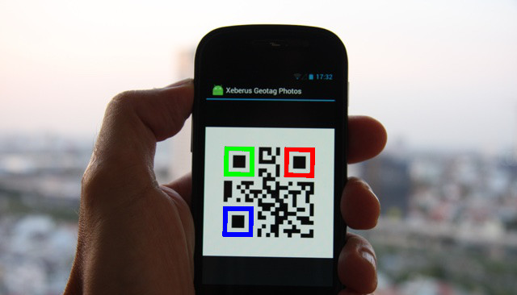

# DSLR Photo Geolocation

Even if modern smartphones can take amazing high-resolution photos, some photographers still prefer using their [digital single-lens reflex (DSLR)](https://en.wikipedia.org/wiki/Digital_single-lens_reflex_camera) cameras to take photographs, and still have the ability to easily geolocate their photographs.

However, as of 2019, most of DSLR cameras have no built-in [GPS](https://en.wikipedia.org/wiki/Global_Positioning_System), meaning photographs taken with a simple DSLR camera have no embedded information about the geographic location where they have been taken. They are not [geotagged](https://en.wikipedia.org/wiki/Geotagged_photograph). The [Exif](https://en.wikipedia.org/wiki/Exif) section of the image file of such photograph doesn't contain fields for latitude and longitude that would identify the geographic location of the shot.

# Requirements

There are various solutions in the market to [geotag](https://en.wikipedia.org/wiki/Geotagging) photographs taken with DSLR cameras, for instance using an external GPS receiver such as a smartphone, but these solutions don't match all of the following criteria:

1. Respect the [intellectual property (IP)](https://en.wikipedia.org/wiki/Intellectual_property) of the photographer;
1. Respect the [privacy](https://en.wikipedia.org/wiki/Privacy) of the photographer;
1. [Open source](https://en.wikipedia.org/wiki/Open_source) solution.

## Intellectual Property Respect

Professional photographers require that the geotagging of their photographs MUST be done locally on their personal computer. They refuse to submit their photographs to an online service to get them geotagged. Their photographs may worth a serious amount of dollars. Professional photographers are quite sensitive about the respect of their intellectual property rights. They want to be sure to keep their photographs under full control.

A photograph geotagging solution should not read the data of a photograph's image file, but it should only read and write the [GPS tags of the Exif information](https://sno.phy.queensu.ca/~phil/exiftool/TagNames/GPS.html) of this photograph's image file.

## Privacy Respect

Professional photographers don't want to share the location of their photographs, the route they have followed to reach a particular location where they shot photographs. They refuse to submit their GPS tracks to an online service if these data are not encrypted with a private key that ensure that even if the online service is hacked by a tiers, this tiers cannot read GPS tracks of photographers.

## Open Source Solution

To be sure that a software solution meets the intellectual property and privacy respect requirements, professional photographers would prefer to use an open source software solution which source code is publicly available. At least, the source code of the software that directly accesses their photographs on their personal computer. Even if most of professional photographers are not software developers, they could rely on the software development community to ensure that the code of the software solution is not leaked.

# Software Solution Architecture

Most of smartphones in the market have geolocation capabilities with [accurate](https://spectrum.ieee.org/tech-talk/semiconductors/design/superaccurate-gps-chips-coming-to-smartphones-in-2018) [GPS](https://www.broadcom.com/company/news/product-releases/2302120). A photographer can use his smartphone as a GPS device to record his route while he is taking photographs with his DSLR camera.

The software solution includes a mobile application (Android or iOS) that allows the photographer to start and stop recording his route. The application doesn't require the mobile phone to be connected to the Internet while it records the route of the photograph. The application encrypts the routes that have been recorded with a passphrase providing by the photographer.

The photograph needs to link his DSLR camera to his smartphone. There is no need to physically link the DSLR camera to the smartphone, using a cable or whatever network connection. When the photograph runs the dedicated mobile application to start recording his route, the mobile application generates and displays a QR code that the photograph needs to shoot with his DSLR camera. The QR code contains an identifier of the route of the photograph. The photograph keeps his mobile phone with him while he travels around and takes some photographs.

| Example of the tracking of a route                      |
| ------------------------------------------------------- |
|  |
|                          |

When the photographer completes his photo tour, he requests his mobile application to stop recording his route. The mobile phone encrypts the route and submits these encrypted data to the online service using a RESTful API.

Once the photographer is back home, he downloads the image files of his photographs in a folder of his personal computer, including the photo of the QR code. The photographer runs a simple application, a [command-line interface (CLI)](https://en.wikipedia.org/wiki/Command-line_interface) application, providing the path to the folder where the image files have been downloaded. The CLI application detects the image file of the QR code, and calls the online service using a RESTful API to retrieve the encrypted data of the corresponding photographer's route.

The CLI application retrieves the Exif information of every photograph image file and reads the capture time given by the DSLR camera. This time may not be accurate, but this is not important as this inaccuracy remains for all the photographs, and as the photograph with the QR code provides the difference between the DSLR camera time and the exact time this photograph has been taken (extracted from the QR code).

The CLI application requests the photographer to enter his passphrase that was used to encrypt the data. The application fetches the route of the photographer and it writes the [GPS tag](https://www.awaresystems.be/imaging/tiff/tifftags/privateifd/gps.html) of the Exif information stored in the image file of each photograph.

**@todo: provide less technical details about the whole procedure.**

# Mission: RESTful API Server

## Waypoint 1: RESTful Endpoints Design

# Mission: Mobile Application

# Mission: Command-Line Interface Application

Arguments:

- `--path` ()
